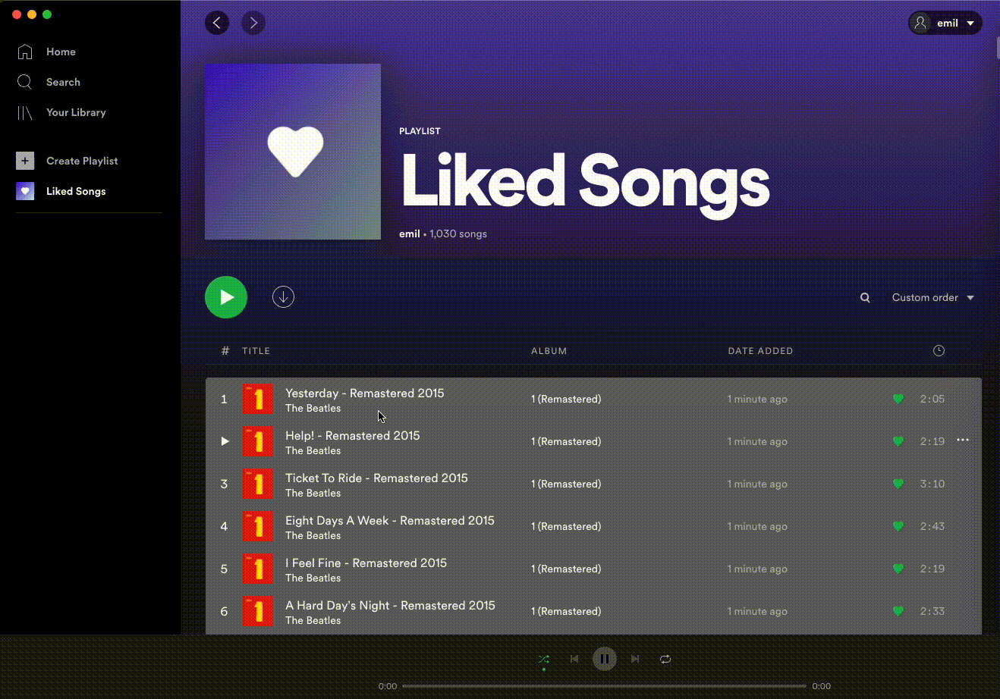
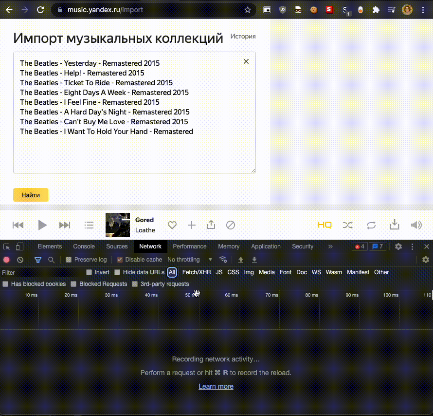
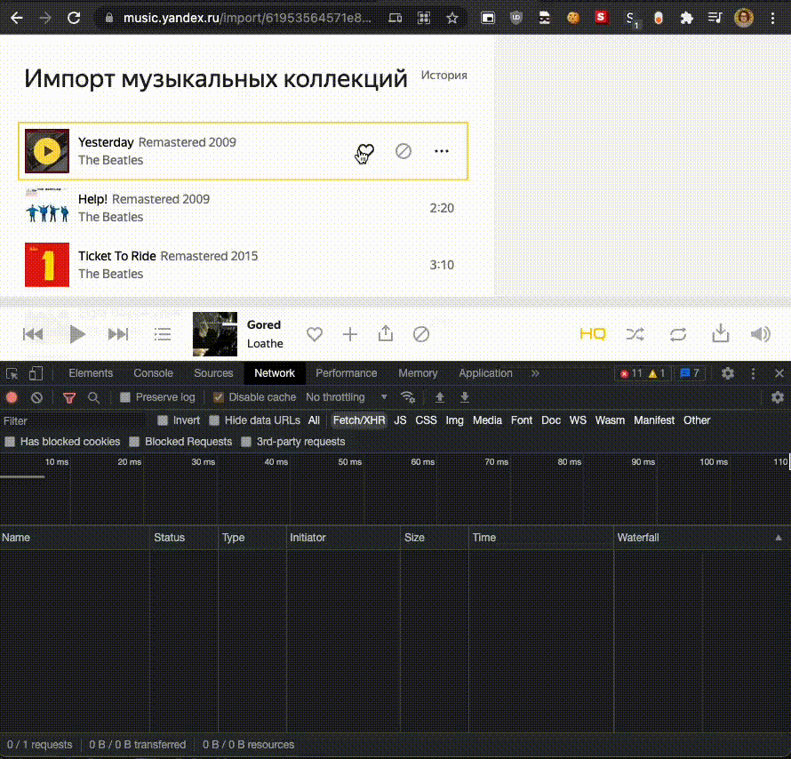
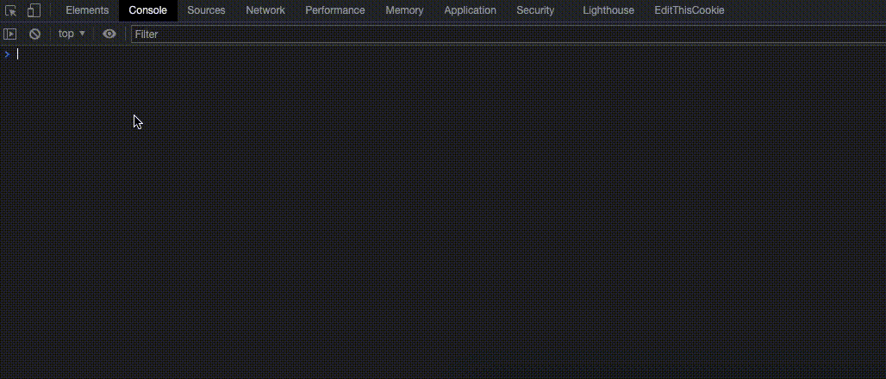
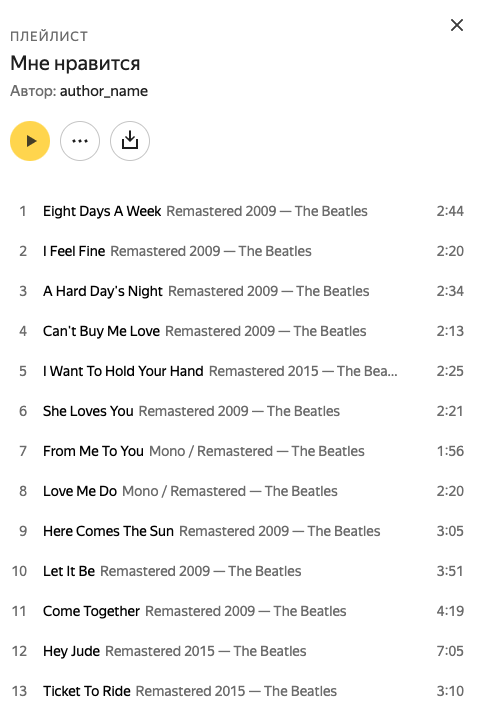

# Импорт любимых треков из Spotify в Яндекс.Музыку

Это пошаговая инструкция как с помощью некоторых манипуляций перенести любимые треки из Spotify в любимые Яндекс Музыки.

Проблема в том что сервисы импорта предлагают импорт _плейлистов_. Т.е. любимые из Спотифая будут в отдельном плейлисте, а не в любимых Яндекс Музыки. Данная инструкция решает эту проблему.

## Шаг 1. Перенесите любимые треки из Spotify в плейлист

- Откройте приложение Spotify на компьютере
- Зажмите Ctrl+A и перенесите выделенную область в пункт меню _"Create Playlist"_
- Скопируйте ссылку на плейлист



## Шаг 2. Сформируйте список треков в формат для импорта

- Перейдите в сервис для [экспорта плейлистов из Spotify](https://www.spotlistr.com/export/spotify-playlist)
- Нажмите на кнопку _"Log in with Spotify to begin!"_
- Нажмите _"Принимаю"_ для доступа к вашему списку треков. Доступ можно будет удалить позже в [аккаунте Spotify](https://www.spotify.com/us/account/apps/)
- Вставьте ссылку полученную в первом шаге


## Шаг 3. Подготовка импорта в Яндекс Музыку

- Откройте в Яндекс Музыке [страницу импорта](https://music.yandex.ru/import)
- Вставьте список треков полученный во втором шаге
- Нажмите F12. Откроется консоль. Перейдите во вкладку _Network_. Выберите только _Fetch/XHR_ запросы
- Нажмите на кнопку _"Найти"_
- Ждите результата
- Нажмите на последний запрос в консоли
- На вкладке _"Preview"_ правой кнопкой мыши скопируйте значение поля _"trackIds"_



## Шаг 4. Подготовка импорта плейлиста в любимые

- Не закрывайте консоль
- Лайкните любой трек
- Перейдите в последний запрос вида _"add?\_\_t=111111111"_
- Перейдите во вкладку Headers и из _"Request Headers"_ скопируйте значение _X-Current-UID_
- Перейдите во вкладку Payload и из _"Form Data"_ скопируйте значение _sign_



## Шаг 5. Запуск скрипта для переноса

- Откройте новый таб с Яндекс.Музыкой
- Откройте консоль через F12
- Перейдите во вкладку Console
- Скопируйте скрипт
- Вставьте полученные значения (sign, uid, tracksid) в начало скрипта
- Нажмите Enter и ждите. Пойдут запросы с задержкой в 200 мс чтобы Яндекс не подумал что это ддос или спам
- В это время можно в соседней владке проверять плейлист с любимыми треками

```js
const SIGN_VALUE = "random_string";
const UID_VALUE = 123456789;
const TRACKIDS_VALUE = ["123:321", "444:555"];

TRACKIDS_VALUE.reverse().forEach((identifier, index) => {
  setTimeout(() => {
    const time = new Date().getTime();
    const url = `/api/v2.1/handlers/track/${identifier}/web-own_playlists-playlist-track-main/like/add?__t=${time}`;

    fetch(url, {
      method: "POST",
      body: new URLSearchParams({ sign: SIGN_VALUE }),
      headers: {
        "X-Current-UID": UID_VALUE,
        "X-Retpath-Y": "https%3A%2F%2Fmusic.yandex.ru",
      },
    })
      .then((res) => console.log(res.data))
      .catch((err) => console.log(err));
  }, index * 200);
});
```

Должно быть как-то так. Дождитесь пока все запросы выполнятся. Это может занять время.



## Шаг 6. Mission complete 🤗

Перенос закончился успешно, треки появились в любимых.



P.S. Если есть какие-то замечания или предложения, пишите в [Issues](https://github.com/yangirov/spotify-to-yandex-music/issues).
