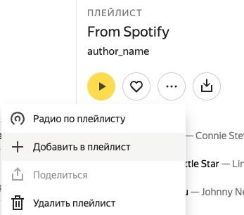
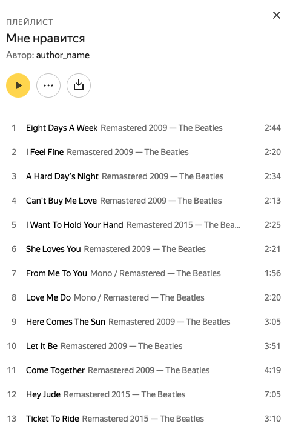

# Импорт любимых треков из Spotify в Яндекс.Музыку

Это пошаговая инструкция как с помощью некоторых манипуляций перенести любимые треки из Spotify в любимые Яндекс Музыки.

Проблема в том что сервисы импорта предлагают импорт _плейлистов_. Т.е. любимые из Спотифая будут в отдельном плейлисте, а не в любимых Яндекс Музыки. Данная инструкция решает эту проблему.

## Шаг 1. Перенесите любимые треки из Spotify в плейлист

- Откройте приложение Spotify на компьютере
- Зажмите Ctrl+A и перенесите выделенную область в пункт меню _"Create Playlist"_
- Скопируйте ссылку на плейлист

## Шаг 2. Сформируйте список треков в формат для импорта

- Перейдите в сервис для [экспорта плейлистов из Spotify](https://www.spotlistr.com/export/spotify-playlist)
- Нажмите на кнопку _"Log in with Spotify to begin!"_
- Нажмите _"Принимаю"_ для доступа к вашему списку треков. Доступ можно будет удалить позже в [аккаунте Spotify](https://www.spotify.com/us/account/apps/)
- Вставьте ссылку полученную в первом шаге

## Шаг 3. Импорт плейлиста в Яндекс Музыку

- Откройте в Яндекс Музыке [страницу импорта](https://music.yandex.ru/import)
- Вставьте список треков полученный во втором шаге
- Нажмите на кнопку _"Найти"_
- Ждите результата
- Сохраните треки в плейлист

## Шаг 4. Импорт в "Мне нравится"

- Откройте страницу плейлиста из предыдущего шага
- Выберите в контекстном меню пункт _"Добавить в плейлист"_
- Добавьте в плейлист _"Мне нравится"_

## Шаг 5. Mission complete 🤗

Перенос закончился успешно, треки появились в любимых.

P.S. Если есть какие-то замечания или предложения, пишите в [Issues](https://github.com/yangirov/spotify-to-yandex-music/issues).
